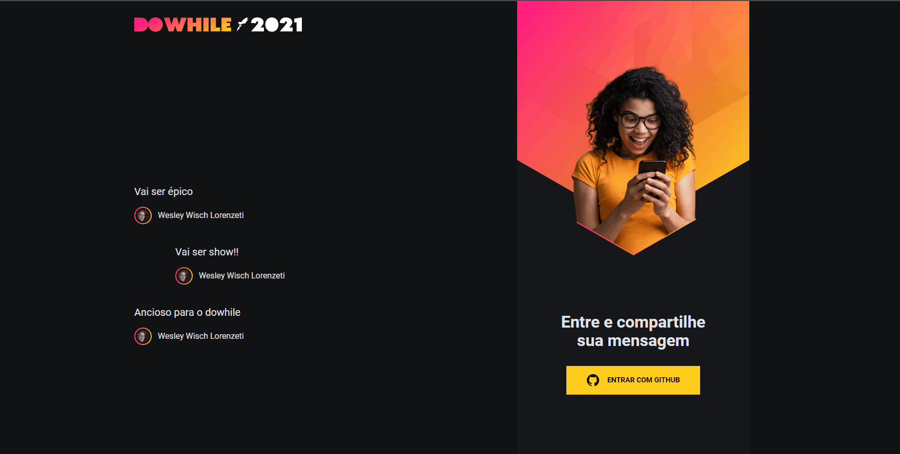
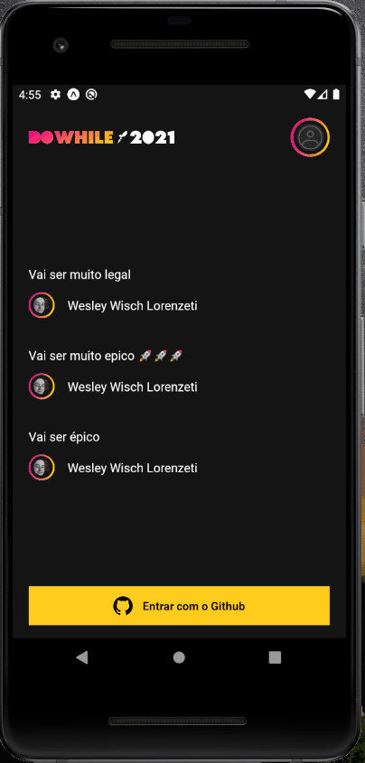

<h1 align="center">🚀 NLW7-Heat-impulse 🚀</h1>

<p align="center">  <a href="#sobre">📋 Sobre</a> • <a href="#layout">🎨 Layout</a> • <a href="#aplicacao">🎲 Aplicação</a>  • <a href="#techs">💻 Tecnologias</a> • <a href="#layout">🔖 Layout</a> • <a href="#licenca">⚠️ Licença</a> </p>


  <h2 id="sobre"> 📋 Sobre o projeto</h2>
  
<p>Projeto desenvolvido durante a NLW (nextlevelweek) na trilha Impulse, onde nessa semana foi construída uma aplicação do zero, backend, frontend e mobile, uma semana intensa e cheio de conteúdo, mais que foi um grande aprendizado, pois aprendi muito a como integrar todas as áreas que ainda estava com um pouco de dificuldade nesse ponto, uma experiência incrível, muito legal, cada dia um dia a mais de aprendizado, ansioso para o próximo. 🚀🚀🚀</p>


<h2 id="layout"> 🎨  Layouts</h2>

### Web:
<p align="center">
	
</p>

### Mobile:
<p align="center">
	
</p>


<h2 id="aplicacao"> 🎲  Rodando essa aplicação:</h2>

Antes de começar, você vai precisar ter instalado em sua máquina as seguintes ferramentas: [Git](https://git-scm.com/), [Node.js](https://nodejs.org/en/), o yarn é opcional [Yarn](https://yarnpkg.com/) e [Expo](https://expo.dev/). Além disto é bom ter um editor para trabalhar com o código como [VSCode](https://code.visualstudio.com/).

Obs: para criar as chaves no github acesse o link - https://github.com/settings/developers

### 🎲  Rodando o Back End (servidor)

```
# Clone este repositório
$ git clone https://github.com/wesleywisch/NLW7-Heat-impulse.git

# obs para funcionar tanto a web e o mobile é preciso deixar o backend rodando.

# obs é preciso criar um .env na pasta (backend) e colocar as seguintes variaveis de ambiente (GITHUB_CLIENT_SECRET) e (GITHUB_CLIENT_ID) ambas geradas pelo github.

# obs para rodar na web na hora da criação das chaves no github na (Homepage URL) colocar (http://localhost:4000) e no (Authorization callback URL) colocar (http://localhost:3000)

# obs para rodar no mobile na hora da criação das chaves no github na (Homepage URL) e (Authorization callback URL) colocar a seguinte url (https://auth.expo.io/@ seu @ do seu usuário expo/nome do app) ex: https://auth.expo.io/@testeExpo/nlwheatapp

# Acesse a pasta do projeto no terminal
$ cd backend

# Instale as dependências
$ npm install ou yarn

# Execute a aplicação
$ yarn dev

# O app estará rodando pela porta 4000.
```

### 🧭  Rodando a aplicação web (Front End)

```
# Clone este repositório
$ git clone https://github.com/wesleywisch/NLW7-Heat-impulse.git

#obs: Dentro da pasta (frontend) e dentro da pasta (src) e dentro de (contexts) no auth.tsx na const signInUrl na linha (36), depois do client_id= colocar sua chave que foi gerado pelo gihub.

# Acesse a pasta do projeto no terminal
$ cd frontend

# Instale as dependências
$ npm install ou yarn

# Execute a aplicação
$ yarn dev

# O app estará disponível no seu browser pelo endereço - http://localhost:3000

```

### 📱  Rodando a aplicação mobile

```
# Clone este repositório
$ git clone https://github.com/wesleywisch/NLW7-Heat-impulse.git

# Obs: Dentro da pasta (mobile) e dentro da pasta (src) e dentro de (services) no api.ts você deve colocar seu ip da maquina ex: http://ipv4 da sua maquina:4000
$ para saber o ipv4 e so abrir o cmd e da ipconfig e pegar o ipv4

#obs: Dentro da pasta (src) e dentro de (hooks) no auth.tsx na const CLIENT_ID colocar sua chave que foi gerado pelo gihub.

# Acesse a pasta do projeto no terminal
$ cd mobile

# Instale as dependências
$ npm install ou yarn

# É necessário ter o expo baixado
$ https://expo.io/

# Depois de baixado o expo você terá duas opções de inicialização
$ 1° opção: é necessário ter o android studio baixado (https://developer.android.com/studio)
$ 2° opção: baixar no seu celular o (Expo Go), que serve tanto Android como iOS.

# Se optar pela 2° opção já pare por aqui que já estará rodando.
$ Rode o comando no cmd (Prompt de Comando) expo start
$ Quando o (Expo Go) for baixado entrar e clicar em Scan QR Code e a câmera irá abrir e só apontar ela para o QR code que apareceu lá no site do expo quando abriu no navegador.

# Se optar pela 1° opção segue esses passos abaixos:

# Pelo cmd (Prompt de Comando).
$ e inicializa o projeto dando expo start
$ Abra o android studio e configure o seu celular da melhor forma que preferir e abre ele.

# Run the app (Android)
$ Aperte no (Run on Android device/emulator)
$ E pronto já estará funcionando
```

 
 <h2 id="techs"> 💻 Tecnologias</h2>
 As seguintes ferramentas foram usadas na construção do projeto:

- BackEnd:
	- [typescript]()
	- [@prisma/client]()
	- [axios]()
	- [cors]()
	- [dotenv]()
	- [express]()
	- [jsonwebtoken]()
	- [socket.io]()
- FrontEnd:
	- [typescript]()
	- [React]() 
	- [axios]()
	- [react-dom]()
	- [react-icons]()
	- [sass]()
	- [socket.io-client]()
- Mobile
	- [typescript]()
	- [Expo]()
	- [axios]()
	- [expo-app-loading]()
	- [expo-auth-session]()
	- [expo-font]()
	- [expo-linear-gradient]()
	- [moti]()
	- [react-native]()
	- [socket.io-client]()
 

<h2 id="layout">🔖 Layout</h2>
Veja o layout no link abaixo (inspiração para o layout web):

- [Layout](https://www.figma.com/community/file/1031699316177416916)

Você precisa de uma conta no [Figma](http://figma.com/) para acessar.

<h2 id="licenca"> ⚠️  Licença</h2>

Esse projeto esta sobre a licença [MIT](https://github.com/wesleywisch/NLW7-Heat-impulse/blob/main/LICENSE).